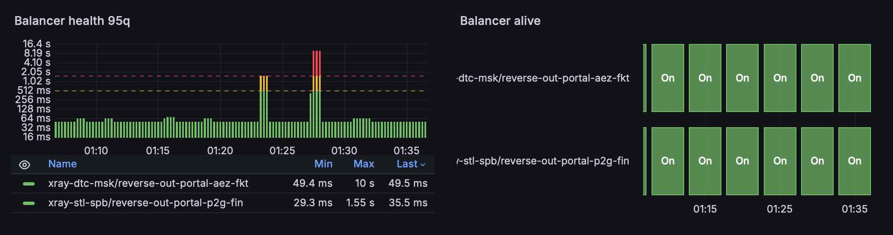

# why



[xray-exporter](https://github.com/compassvpn/xray-exporter) does not provide statistics 
for balancer observatories in `x-ray` / `3x-ui` because the Xray Core itself does not 
expose this information through the gRPC Stats endpoint.

This microservice allows you to add balancer metrics using the standard 
HTTP ([/debug/vars](https://xtls.github.io/en/config/metrics.html)) metrics endpoint 
provided by Xray.

It can also proxy requests to xray-exporter and append the balancer metrics to its output, 
allowing the scraper to collect all metrics in a single HTTP request.

## arguments

| Option | Description | Default |
|---|---|---|
| `-listen string` | Exporter listen address | `127.0.0.1:3000` |
| `-metrics-path string` | Path that serves the Xray metrics | `/metrics` |
| `-metrics-prefix string` | Prometheus metrics name prefix | `xray_vars` |
| `-proxy-pass-metrics-before-address string` | Append proxy result before the metrics payload (e.g. xray-exporter address) | — |
| `-xray-metrics-address string` | Xray metrics address | `http://127.0.0.1:11111` |
| `-xray-polling-interval duration` | Xray polling interval | `5s` |
| `-xray-polling-timeout duration` | Xray polling timeout | `5s` |

- `-xray-metrics-address` copy from 3x-ui Settings → Xray Configs → Basic → Statistics Tab → Metrics Endpoint Input
- `-proxy-pass-metrics-before-address` provide optional address of the `xray-exporter` metrics endpoint so that this service can proxy the request and append its response to the main metrics response, thereby **enriching** it.

## output

```
# HELP xray_vars_observatory_alive Whether the Xray observatory outbound is alive.
# TYPE xray_vars_observatory_alive gauge
xray_vars_observatory_alive{outbound="reverse-out-portal"} 1

# HELP xray_vars_observatory_delay_ms Xray observatory probe delay in milliseconds.
# TYPE xray_vars_observatory_delay_ms gauge
xray_vars_observatory_delay_ms{outbound="reverse-out-portal"} 43

# HELP xray_vars_observatory_delay_ms_histogram Xray observatory probe delay in milliseconds
# TYPE xray_vars_observatory_delay_ms_histogram histogram
xray_vars_observatory_delay_ms_histogram_bucket{outbound="reverse-out-portal",le="1"} 0
xray_vars_observatory_delay_ms_histogram_bucket{outbound="reverse-out-portal",le="2"} 0
xray_vars_observatory_delay_ms_histogram_bucket{outbound="reverse-out-portal",le="5"} 0
xray_vars_observatory_delay_ms_histogram_bucket{outbound="reverse-out-portal",le="10"} 0
xray_vars_observatory_delay_ms_histogram_bucket{outbound="reverse-out-portal",le="20"} 0
xray_vars_observatory_delay_ms_histogram_bucket{outbound="reverse-out-portal",le="30"} 0
xray_vars_observatory_delay_ms_histogram_bucket{outbound="reverse-out-portal",le="40"} 0
xray_vars_observatory_delay_ms_histogram_bucket{outbound="reverse-out-portal",le="50"} 1677
xray_vars_observatory_delay_ms_histogram_bucket{outbound="reverse-out-portal",le="75"} 1753
xray_vars_observatory_delay_ms_histogram_bucket{outbound="reverse-out-portal",le="100"} 1754
xray_vars_observatory_delay_ms_histogram_bucket{outbound="reverse-out-portal",le="150"} 1754
xray_vars_observatory_delay_ms_histogram_bucket{outbound="reverse-out-portal",le="200"} 1754
xray_vars_observatory_delay_ms_histogram_bucket{outbound="reverse-out-portal",le="300"} 1754
xray_vars_observatory_delay_ms_histogram_bucket{outbound="reverse-out-portal",le="500"} 1754
xray_vars_observatory_delay_ms_histogram_bucket{outbound="reverse-out-portal",le="1000"} 1754
xray_vars_observatory_delay_ms_histogram_bucket{outbound="reverse-out-portal",le="2000"} 1754
xray_vars_observatory_delay_ms_histogram_bucket{outbound="reverse-out-portal",le="5000"} 1754
xray_vars_observatory_delay_ms_histogram_bucket{outbound="reverse-out-portal",le="10000"} 1754
xray_vars_observatory_delay_ms_histogram_bucket{outbound="reverse-out-portal",le="+Inf"} 2076
xray_vars_observatory_delay_ms_histogram_sum{outbound="reverse-out-portal"} 3.2200078699e+10
xray_vars_observatory_delay_ms_histogram_count{outbound="reverse-out-portal"} 2076

# HELP xray_vars_observatory_last_seen_timestamp Unix timestamp when the outbound was last seen alive.
# TYPE xray_vars_observatory_last_seen_timestamp gauge
xray_vars_observatory_last_seen_timestamp{outbound="reverse-out-portal"} 1.78873324e+09

# HELP xray_vars_observatory_last_try_timestamp Unix timestamp when the outbound was last probed.
# TYPE xray_vars_observatory_last_try_timestamp gauge
xray_vars_observatory_last_try_timestamp{outbound="reverse-out-portal"} 1.78873324e+09

# HELP xray_vars_scrape_errors_total Total number of failed Xray observatory scrapes.
# TYPE xray_vars_scrape_errors_total counter
xray_vars_scrape_errors_total 0
```
